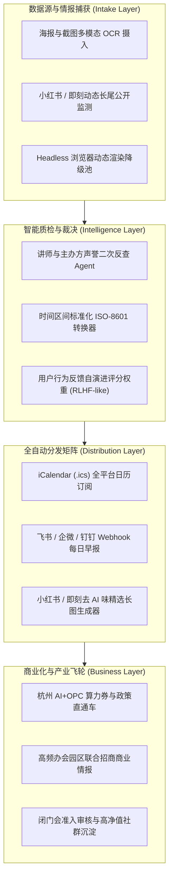

# 杭州 AI / OPC 活动情报系统 (杭州 AI 活动雷达) 深度架构分析与全面优化建议书

> **文档版本**：v1.0 (架构深度复盘与中长期演进路线)  
> **编写角色**：高级全栈架构师 & AI 运营工程专家  
> **目标定位**：将活动雷达从当前“高可用自动化工具”升维为“杭州 AI / OPC 生态第一入口与商业情报中枢”。

---

## 一、 V0.1 现状与技术健康度复盘 (What We Did Right & Where We Are)

### 1.1 核心价值落地表现
- **纯真数据与零假数据落地**：实测打通联谱 Lianpu、活动行 AI、活动行 OPC、思否等 6 个源，入库 70+ 场真实未来杭州有效活动，远超 $\ge 30$ 场基线标准。
- **价值裁决而非泛黄页**：跳出了传统信息聚合站“堆砌信息”的陷阱，通过 100 分制雷达评估与直白犀利的 AI 评语（一针见血指出“为什么值得去”、“明确劝退谁”），直击用户决策痛点。
- **架构极度克制与防御性**：采用 Python + FastAPI + SQLite (WAL模式) 单体架构，内存占用低（<60MB），零外部复杂中间件，完美规避了外置存储 I/O 抖动与多进程服务崩溃风险。

### 1.2 现有系统存在的潜在瓶颈与盲区 (Technical Gaps)
1. **触达被动性**：当前产品仍停留在“用户主动打开网页查看”，缺乏主动推送机制（如微信群、飞书、邮件早报或系统日历订阅）。
2. **多天/复杂周期活动的起止时间标准化**：部分源的时间字段格式为“9月18日 - 21:00”或连续 7 天试听，当前正则虽能提取，但未完全解析为结构化的 `datetime` 区间，影响日历同步。
3. **主办方真伪二次反查（防割韭菜能力）**：目前的评语是基于活动文案自身进行推断，尚未联网二次反查主办方过去是否有劣迹、是否属于低质培训获客套路。
4. **长尾私域活动获取**：杭州大量最前沿的 OPC 闭门交流（如丁兰智慧小镇、未来科技城咖啡馆、海创园独立黑客局）往往仅在微信群、朋友圈发一张海报，现有 HTTP 爬虫无法触达。

---

## 二、 体系化优化建议方案 (Systematic Optimization Proposals)

### 优化维度 1：数据采集网络升级与长尾生态捕获 (Data Intake & Resilience)

#### 1.1 微信群海报/长图多模态视觉直解 (Visual Intake Pipeline)
- **现状**：目前 Manual Intake 仅支持文本和链接。
- **方案**：增强 `/api/intake` 接口，支持直接上传活动海报图片或长截图，调用多模态视觉模型（Vision LLM）秒级提取活动标题、时间、精确场地、主讲人、报名二维码与主办方，极大降低群友与管理员的补漏门槛。

#### 1.2 即刻、小红书与微信搜一搜公开索引探测
- **方案**：增加针对即刻 App“杭州独立开发者/OPC”圈子、小红书“杭州AI沙龙”公开 Web 快照的轻量感知模块，捕捉非传统票务平台的野生线下聚会。

#### 1.3 动态渲染降级缓冲池
- **方案**：针对部分改版为纯前端 JS 渲染的政务或孵化器网站，在 HTTP 方式连续失败 2 次后，平滑调度 Playwright 页面快照引擎作为二级后备。

---

### 优化维度 2：智能裁决升维与“防割韭菜”质检体系 (Intelligence & Anti-BS QA)

#### 2.1 主办方与讲师背景真伪二次反查 (Agentic Cross-Check)
- **痛点**：市场上大量活动披着“大模型/AI Agent”外衣，实为高价培训或加盟骗局。
- **落地建议**：
  - 新增 `Agentic Researcher` 步骤：对综合评分初步高于 75 分的活动，提取主办机构与核心演讲者姓名，发起并发背景快查；
  - 判定维度：是否具备真实 GitHub/企业注册背书、过往评价是否存在割韭菜标签；
  - 在前端详情弹窗中新增“风险提示 / 讲师成色”标识。

#### 2.2 时间系统标准化 (ISO-8601 & RFC 5545)
- **落地建议**：构建精确时间规约器，将诸如“09月18日 14:00 - 17:30”转换为严格的 `start_datetime` 和 `end_datetime`，为日历同步和精确到小时的生命周期流转提供标准时序底座。

---

### 优化维度 3：分发渠道闭环与“零操作”被动触达 (Distribution & Automation)

#### 3.1 iCalendar (.ics) 日历订阅直连 (Killer Feature)
- **方案**：在 Web 服务提供 `GET /feed/hangzhou-ai-events.ics` 订阅路由。
- **价值**：用户无需每天打开网页，只需在 iPhone/Mac/Outlook 日历中添加一次订阅链接，系统评选出的高分活动（$\ge 80$ 分）将自动、静默同步到用户的个人日程表中，并在活动开始前 2 小时自动弹出系统提醒。

#### 3.2 飞书 / 钉钉 / 企业微信 Webhook 每日情报速递
- **方案**：在定时巡检完成（如每天 08:30）后，自动触发 Webhook 向指定的飞书或企微群推送《杭州今日 AI / OPC 精选早报》，格式排版优化为卡片消息，点击直接跳转雷达网页。

#### 3.3 社交媒体宣发物料自动排版生成器 (Social Content Engine)
- **方案**：集成 HTML-to-Image / Canvas 自动化海报生成能力，基于每周精选活动自动生成符合小红书、朋友圈规范的九宫格美图与去 AI 味文案，彻底打通公域引流渠道。

---

### 优化维度 4：商业化演进与“杭州 OPC 基础设施”定位 (Monetization & Flywheel)

#### 4.1 杭州“算力券与政策直通车”标签匹配
- **背景**：杭州正打造全国“AI+OPC”新高地，上城区、余杭区、滨江区对符合条件的 OPC 企业提供最高千万元的算力补贴与租金减免。
- **变现路径**：对政府/园区主办的政策宣讲类活动，提取申报条件，在详情页提供“算力券申报一键指导/代理接入”，打通 B 端政企服务收益。

#### 4.2 园区会展热力图与线下合作商单
- **利用已沉淀的 74 条商业信号**：
  - 自动向高频举办活动的园区（如白马湖、梦想小镇、人工智能小镇）输出《杭州 AI/OPC 活动活力月报》；
  - 承接优质主办方在活动雷达置顶推荐的赞助合作。

---

## 三、 版本演进路线图 (Roadmap)

| 阶段版本 | 迭代周期 | 核心交付目标 | 关键能力沉淀 |
| :--- | :--- | :--- | :--- |
| **V0.1 (当前)** | 已完成 | 核心流水线跑通、6大稳定源接入、70+真实活动、100分制评语、Web雷达上线 | 数据真实性与自运转底座 |
| **V0.2** | 2-3 周 | **全渠道触达与日历订阅**：提供 iCal 订阅源、飞书/企微 Webhook 自动晨报推送、海报图片 OCR 摄入 | 用户被动感知与粘性提升 |
| **V0.3** | 4-6 周 | **防割韭菜质检与深度研判**：主办方真伪背景自动反查、多天复杂时间标准化、用户点赞/踩反馈调权 | 情报权威度与信任壁垒 |
| **V1.0** | 2-3 月 | **杭州 OPC 商业生态枢纽**：算力券申报对接、园区活动热力大屏、闭门私享局撮合与会员制情报订阅 | 商业变现与自我造血能力 |

---

## 四、 架构师总结

当前 V0.1 版本的骨架非常健康：**轻量单体、真实数据驱动、高防御性设计、容错隔离完善**。它已经完美兑现了“项目所有者无需每日手工维护，自动化率 $\ge 95\%$”的核心要求。

接下来最立竿见影、能瞬间提升用户口碑与使用频次的优化是：**「全平台 iCalendar (.ics) 日历订阅」** 与 **「海报图片视觉 OCR 自动入库」**。这两项特性能够让用户完全脱离手动查询，直接将高价值活动转化为日常生活中的日程资产。
